# Samochodoza ;-)

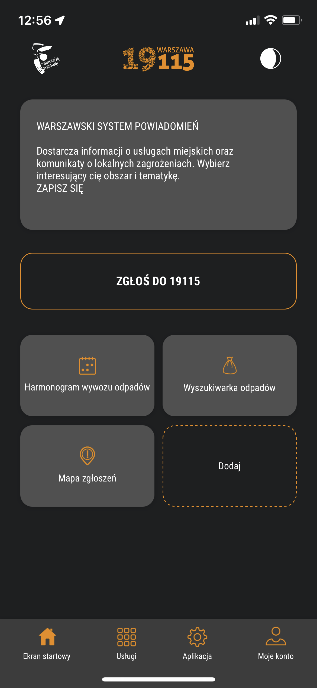
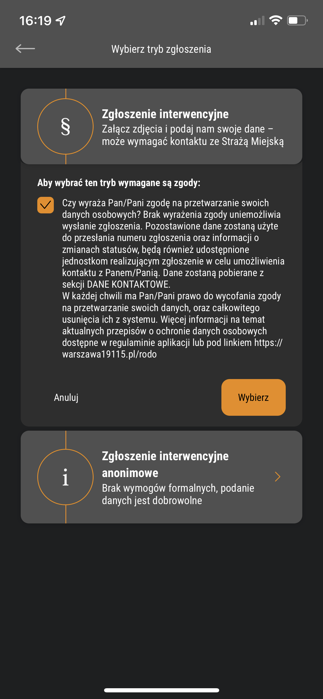

Drogi

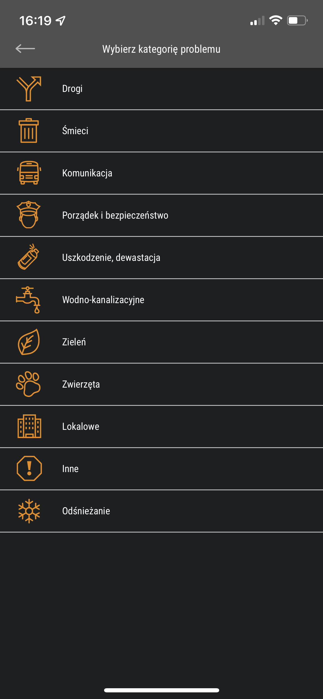

Źle zaparkowane pojazdy

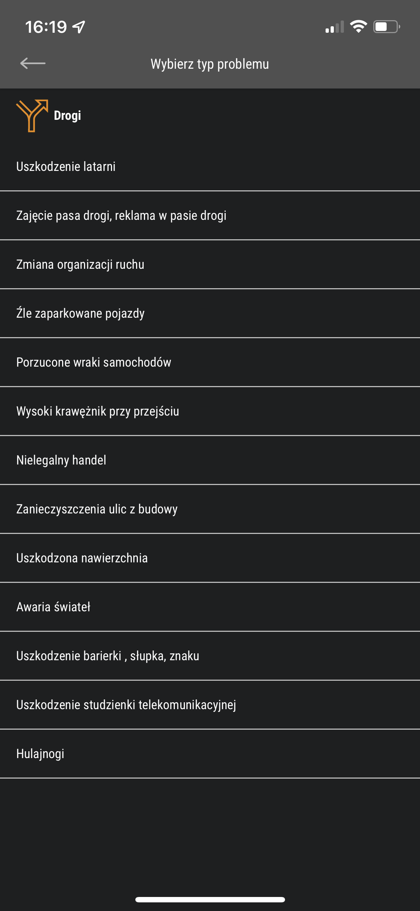

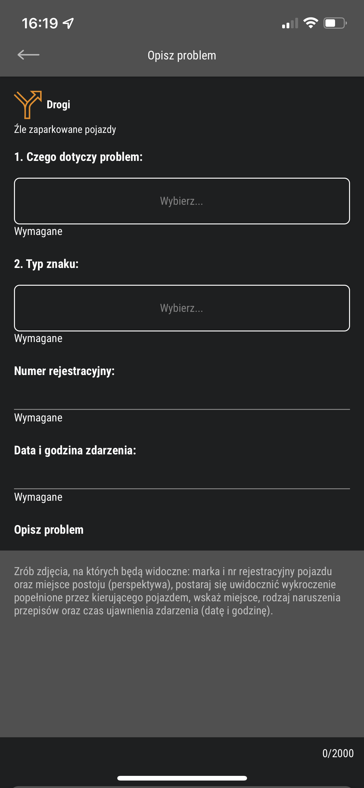
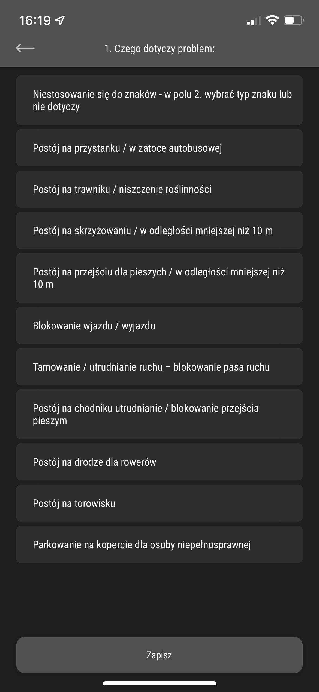
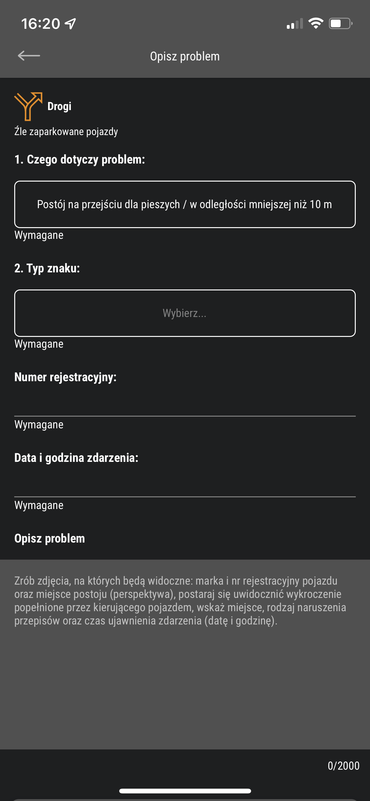
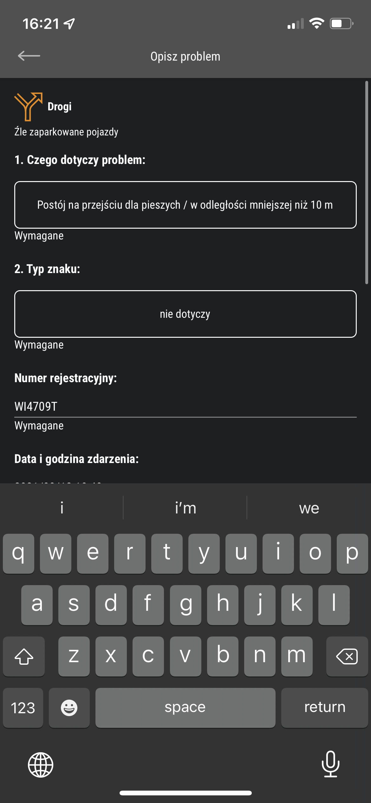
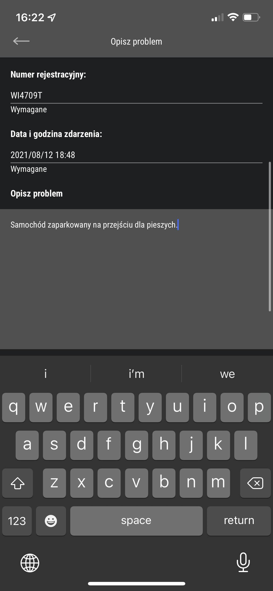

Wybieramy "problem": "Postój ..."

Typ znaku "nie dotyczy"

Niestety trzeba przepisać numer rejestracyjny ze zdjęcia

Niestety też ręcznie wpisujemy Data i Godzinę.

Opisuje zdarzenie.

Propozycje:

    Samochód blokuje cały chodnik, dodatkowo zaparkowany przy pasach dla pieszych.
    Samochód zaparkowany na pasach dla pieszych.

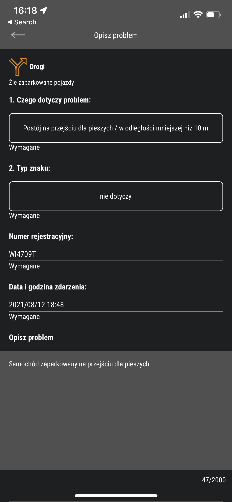
Dodajemy 2-3 zdjęcia aby było łatwiej zidentyfikować problem.

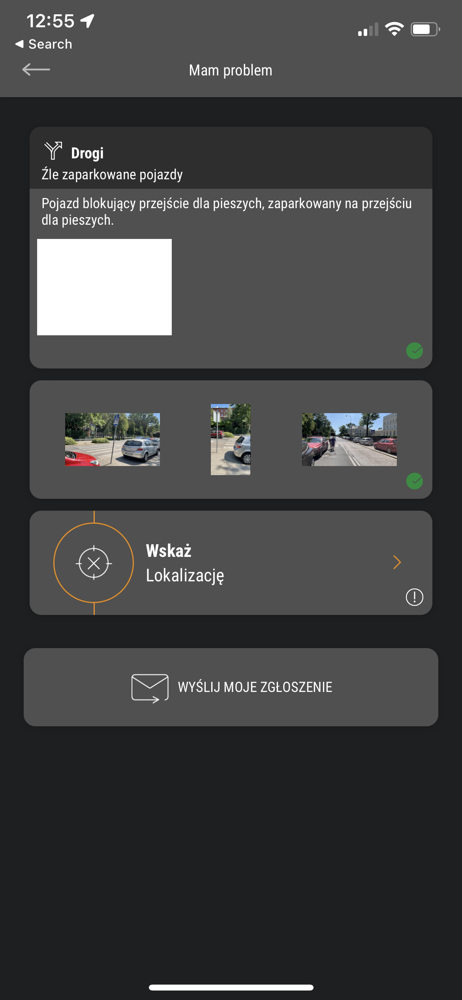
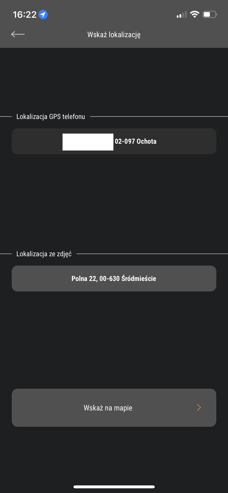

Wskazujemy lokalizacje, aplikacja może też wyczytać ją ze zdjęć! To bardzo przydatne bo można sobie wrócić z wycieczki rowerowej i pozgłaszać.

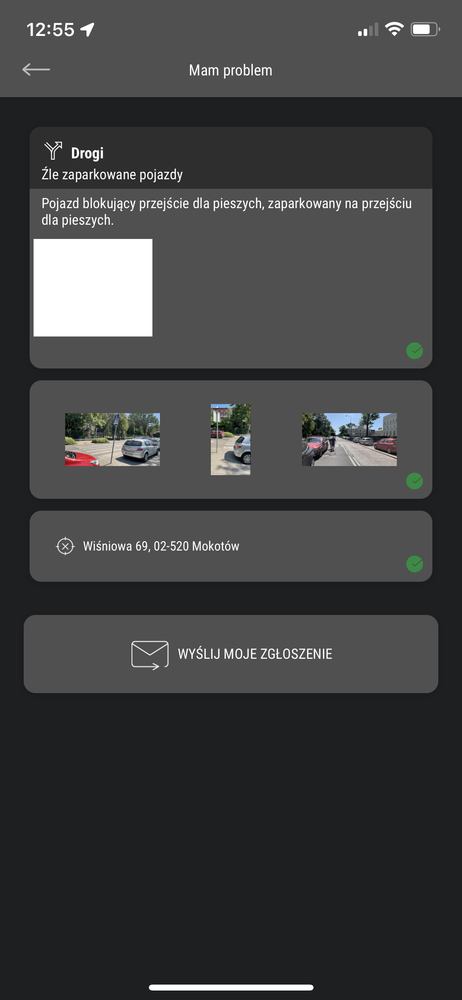

Wyślij!

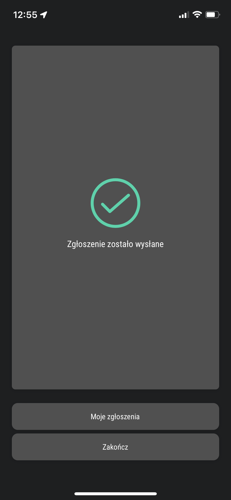

Po chwili na maila dostaniesz powiadomienie, że sprawa została przyjęta.

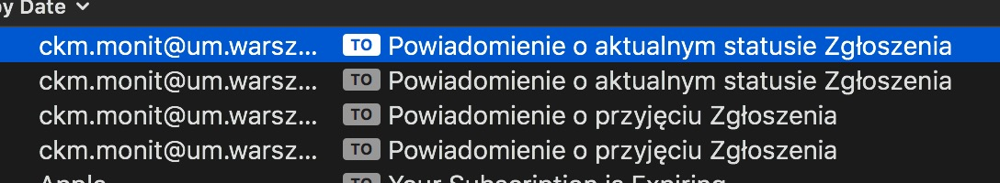
